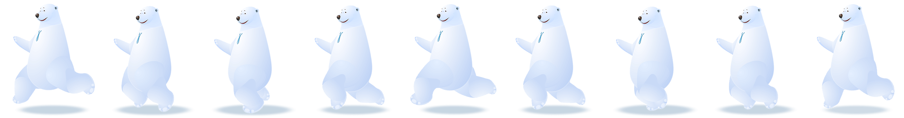

# panda
写的第一个有稿的h5游戏，事件是触摸事件，在手机打开或者模拟触摸事件才能触发，纯js代码

##代码
####游戏规则：亲到熊，把家具拿回来
没有用框架，适配屏幕都是个辛苦的活
````javascript
<!DOCTYPE html>
<html lang="en">
<head>
	<meta charset="UTF-8">
	<title>panda</title>
  <meta name="viewport" content="width=device-width, initial-scale=1.0, maximum-scale=1.0">
  <script src="js/zepto.min.js"></script>
	<script type="text/javascript">

	$(document).ready(function(){	
  	 var wid=$(window).width();
     var hei=$(window).height();
     var scaleWid=1;
     var scaleTouch=320/wid;

     var canvas = document.getElementById("myCanvas");
     var ctx=canvas.getContext("2d");
     // canvas.width = wid;
     // canvas.height = hei;

     var pandaX=0;
     var pandaMove=0;
     var pandaLeft=0;

     var handX=0;
     var handMove=31;
     var handLeft=0;
     var handDrop=10;

     var click=10;
     var clickX=0;
     var clickY=0;
     var gost=[];

     var electricX =80;
     var electricY =132;
     var electric =1;
     var electricStatus=0;

     var score=0;

     var time=174*scaleWid;
     var girlY=hei*scaleTouch-105;

     var img=document.getElementById("panda");
     var img2=document.getElementById("hand");
     var panda2=document.getElementById("panda2");
     var hand2=document.getElementById("hand2");
     var girl=document.getElementById("girl");
     var kiss=document.getElementById("kiss");
     var star=document.getElementById("star");
     var kongtiao=document.getElementById("kongtiao");

     document.body.addEventListener('touchmove', function(event) { 
        event.preventDefault(); 
      }, false);
     document.body.addEventListener('touchstart', function(event) { 
         for (var i = 0; i < event.touches.length; i++) {
          var touch = event.touches[i];
           clickX=160-(touch.pageX*scaleTouch);
           clickY=girlY-(touch.pageY*scaleTouch); 
           
           click=Math.round(Math.sqrt((clickX*clickX)+(clickY*clickY))/40);
           gost.push([clickX,clickY,click,0]);  
         }     
     },false);


     setInterval(function(){
         ctx.clearRect(0, 0, wid, hei);  
         //顶部分数栏
         if(time>65*scaleWid){
          ctx.beginPath();
           ctx.moveTo(66*scaleWid,18*scaleWid); 
           ctx.lineTo(time,18*scaleWid);
           ctx.lineCap="round";
           ctx.lineWidth = 12*scaleWid; 
           ctx.strokeStyle = "#ef5aa2";
           ctx.stroke();           
           ctx.closePath();           
           time=time-(0.03*scaleWid);
         }
         ctx.font=10*scaleWid+"px Arial";
         ctx.fillStyle="#fff";
         ctx.fillText(score,250*scaleWid,22*scaleWid);
         ctx.drawImage(star,0,0,640,63,0,0,320,31.5);
         //熊
         
         if(pandaLeft==0){
          ctx.drawImage(img,pandaX,0,281,332,pandaMove,70,130,130*332/281);
          if(electricStatus==0){        
            ctx.save(); 
            ctx.translate(electricX,electricY);
            ctx.rotate(-50*Math.PI/180);
            ctx.drawImage(kongtiao,0,0,138,46,-35,-12,69,23);          
            ctx.restore();
          } 
          ctx.drawImage(img2,handX,0,110,95,handMove,89,85,85*332/281);
          if(handDrop>9){
            pandaMove=pandaMove+7;handMove=handMove+7;electricX=electricX+7;
          }
         }
         if(pandaLeft==1){
          ctx.drawImage(panda2,pandaX,0,281,332,pandaMove,70,130,130*332/281); 
          if(electricStatus==0){
            ctx.save(); 
            ctx.translate(electricX,electricY);
            ctx.rotate(50*Math.PI/180);
            ctx.drawImage(kongtiao,0,0,138,46,-35,-12,69,23);          
            ctx.restore(); 
          }
          ctx.drawImage(hand2,handX,0,110,95,handMove,89,85,85*332/281);
          if(handDrop>9){
            pandaMove=pandaMove-7;handMove=handMove-7;electricX=electricX-7;
          }
         }
         
         if(pandaMove>320*scaleWid){pandaLeft=1;handMove=340*scaleWid;handX=440;electricX=370*scaleWid;electric =1;electricY =132;electricStatus=0;}
         if(pandaMove<-130){pandaLeft=0;handMove=-99;handX=0;electricX=-50;electric =1;electricY =132;electricStatus=0;}

           pandaX+=281;
          if(pandaX>2528){pandaX=0;}

         if(handDrop<10&&pandaLeft==0){
           electricY=electricY+((girlY-electricY)/9*handDrop);
           electricX=electricX+((160-electricX)/9*handDrop);
           handX+=110;
           if(handX>540){handX=0;}
           handDrop++;
           if(handDrop==10){electricStatus=1;}
           ctx.font="25px Arial";
           ctx.fillStyle="red";
           ctx.fillText("+ 10",250,girlY);
         }
         if(handDrop<10&&pandaLeft==1){
           electricY=electricY+((girlY-electricY)/9*handDrop);
           electricX=electricX+((160-electricX)/9*handDrop);
           handX-=110;
           if(handX<-1){handX=440;}
           handDrop++;
           if(handDrop==10){electricStatus=1;}
           ctx.font="25px Arial";
           ctx.fillStyle="red";
           ctx.fillText("+ 10",250,girlY);
         }
         //kiss
         
           $.each(gost,function(n,value) {
             if(gost[n][3]<gost[n][2]+1){
               ctx.drawImage(kiss,0,0,69,57,160-(gost[n][0]/gost[n][2]*gost[n][3]),girlY-(gost[n][1]/gost[n][2]*gost[n][3]),40,40*57/69);
               gost[n][3]++;
             }

             if(girlY-(gost[n][1]/gost[n][2]*gost[n][3])>70&&girlY-(gost[n][1]/gost[n][2]*gost[n][3])<130*332/281&&160-(gost[n][0]/gost[n][2]*gost[n][3])>pandaMove&&160-(gost[n][0]/gost[n][2]*gost[n][3])<pandaMove+130&&pandaLeft==0&&electric==1){handDrop=0;electric=0;score+=10;}
             
             if(girlY-(gost[n][1]/gost[n][2]*gost[n][3])>70&&girlY-(gost[n][1]/gost[n][2]*gost[n][3])<130*332/281&&160-(gost[n][0]/gost[n][2]*gost[n][3])>pandaMove+20&&160-(gost[n][0]/gost[n][2]*gost[n][3])<pandaMove+110&&pandaLeft==1&&electric==1){handDrop=0;electric=0;score+=10;}

             if(gost[n][3]==gost[n][2]+1){gost.splice(n,1);}
            
           });
         
         //女孩子
         ctx.drawImage(girl,0,0,640,388,0,hei*scaleTouch-(320*388/640),320,320*388/640); 
     }, 30);

  })


	</script>
  <style>
  html,body{width: 100%;height: 100%;margin: 0;overflow: hidden;}
  .content{width: 100%;height: 100%;overflow: hidden;}
  #myCanvas{width:100%;position: absolute;left: 0;top: 0;}
  .bg{width: 100%;display: block;}
  </style>
</head>
<body>





<div class="score"></div>
  <div class="content">
  
  	<canvas id="myCanvas" width="320" height="576">
  		
  	</canvas>
  </div>

</body>
</html>
```
